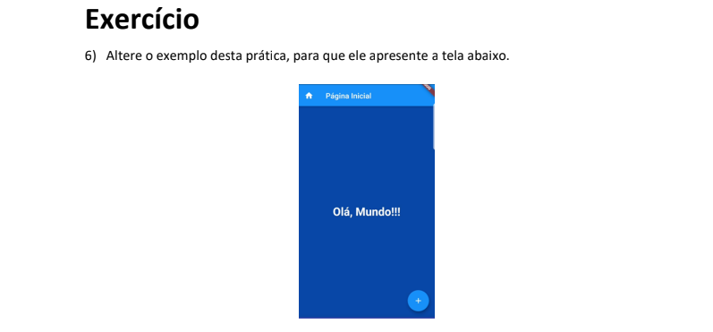

<h1 align="center"> Atividade 6 </h1>

  <a href="#descrição-do-projeto">Descrição do Projeto</a>&nbsp;&nbsp;&nbsp;|&nbsp;&nbsp;&nbsp;
  <a href="#tecnologias-utilizadas">Tecnologias Utilizadas</a>&nbsp;&nbsp;&nbsp;|&nbsp;&nbsp;&nbsp;
  <a href="#como-utilizar">Como Utilizar</a>&nbsp;&nbsp;&nbsp;|&nbsp;&nbsp;&nbsp;
  <a href="#licença">Licença</a>&nbsp;&nbsp;&nbsp;|&nbsp;&nbsp;&nbsp;
  <a href="#autor">Autor</a>

  

## Descrição do Projeto

Este código é um exemplo de um aplicativo Flutter simples que cria uma página inicial com um botão flutuante. O aplicativo utiliza o framework Flutter para criar uma interface de usuário móvel.

## Tecnologias Utilizadas

- *Linguagens:* Dart
- *Framework* Flutter
- *Controle de Versão:* Git
- *IDE:* Visual Studio Code
- *Hospedagem do Código:* GitHub

## Como Utilizar

Para utilizar o projeto localmente, siga estas etapas:

1. Certifique-se de ter o ambiente Dart instalado em seu sistema.

- caso nao tenha instale o [Flutter](https://flutter.dev/) e tambem o [AndroidStudio](https://developer.android.com/studio?gclid=Cj0KCQjw9rSoBhCiARIsAFOiplmlWZxo3tQzwaykI1VFWD6bP7Sc5ev9P14URhxPh2ObbaM5Xi-c0acaAmR-EALw_wcB&gclsrc=aw.ds)
- para facilitar a instalação indico voçê ler a documentação e assistir esse video [YOUTUBE](https://www.youtube.com/watch?v=wcO-Et_jpeo)

2. Clone o repositório deste projeto:

   bash
   git clone https://github.com/LucelhoSilva/Usabilidade.git
   cd atividade_6
   

3. Vá ate a pasta lib e execute o main.dart

## Licença

Este projeto está sob a . Consulte o arquivo [LICENSE](./LICENSE) para obter mais detalhes.

## Autor

Feito por:
Beatriz Alves De Souza - 32217235
Bianca Mayra De Assis Aguiar - 322124358
Gabriel Anjos - 322123390
João Vitor Da Silva Jesus - 32227515
Lucelho Crisitano Vieira Da Silva - 32218540
Rafael Prazeres Moura - 322117187
Pedro Henrique Pinheiro Frois - 322117445.

