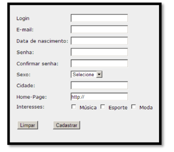

3) Um site de receitas culinárias, contendo uma home page com imagens de 3 receitas de
sua escolha. Ao clicar numa das imagens, o usuário deve ser redirecionado para a página
da respectiva receita. A página de cada receita deve possuir o nome da receita, uma
imagem da receita, a lista não ordenada de ingredientes e a lista ordenada do passo a
posso. Cada página de receita também deve possuir um link para a home page.
4) Um site de apresentação de currículo. O site deve possuir uma página de login que
apresente o formulário de login e um link para a página de cadastro. No formulário de
login, o usuário deve informar e-mail e senha. No formulário da página de cadastro, o
usuário deve informar: nome, data de nascimento, e-mail, senha e confirmação de
senha. A página de cadastro deve possuir um link para a página de login. Clicando no
botão do formulário de login ou de cadastro, o usuário deve ser redirecionado para uma
página de currículo. A página de currículo deve apresentar os dados de um profissional:
foto, nome, data de nascimento, profissão, escolaridade e uma lista ordenada de
experiências profissionais. A página de currículo deve apresentar um link para a página
de login.
5) O formulário abaixo. O formulário deve ser apresentado centralizado horizontalmente.

